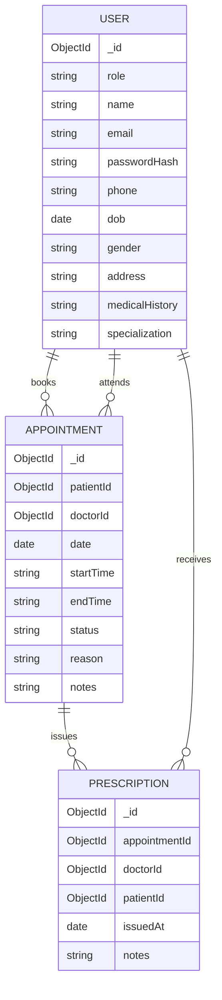

```mermaid
erDiagram
    USER {
        ObjectId _id
        string role
        string name
        string email
        string passwordHash
        string phone
        date dob
        string gender
        string address
        string medicalHistory
        string specialization
    }
    APPOINTMENT {
        ObjectId _id
        ObjectId patientId
        ObjectId doctorId
        date date
        string startTime
        string endTime
        string status
        string reason
        string notes
    }
    PRESCRIPTION {
        ObjectId _id
        ObjectId appointmentId
        ObjectId doctorId
        ObjectId patientId
        date issuedAt
        string notes
    }
    USER ||--o{ APPOINTMENT : books
    USER ||--o{ APPOINTMENT : attends
    APPOINTMENT ||--o{ PRESCRIPTION : issues
    USER ||--o{ PRESCRIPTION : receives
```
